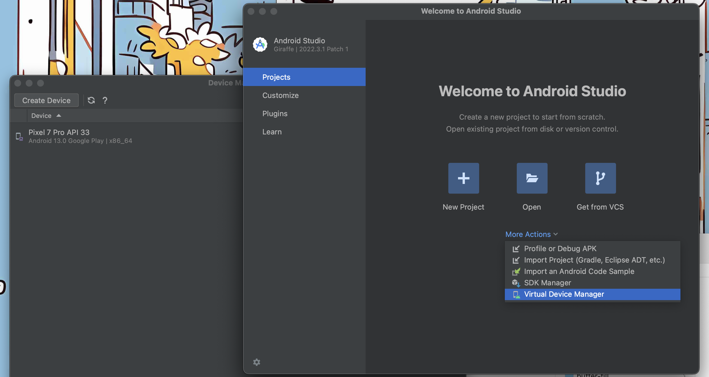
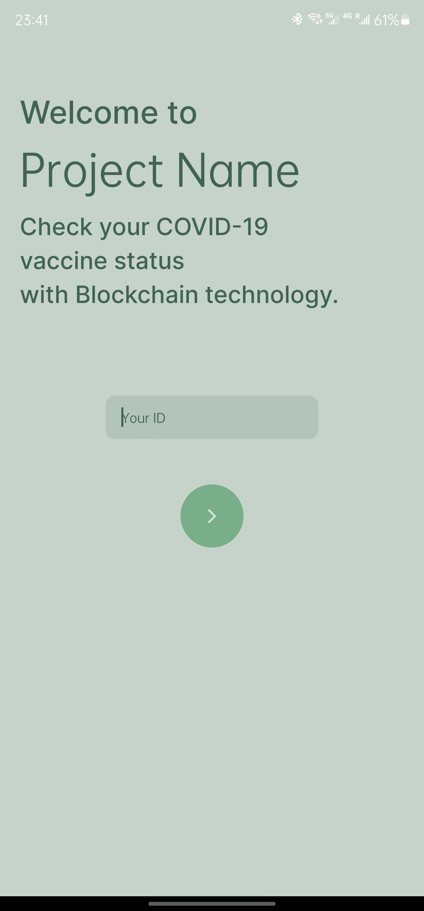

# Vaccine-Tracker

Expo + Tamagui

## 配环境

如果只涉及到UI布局的的话，可以不用配置移动端开发环境，直接在web端进行开发。

但我更推荐把移动端的开发环境都配好，毕竟会涉及到相机和手机端metamask。。。

### 移动端开发环境

对于mac，建议只要配iOS的环境就行了（安卓的好麻烦

Windows只有安卓就没办法了

具体方法可以参考下面的链接，做到“Creating a new application”之前就行了。

#### [For Mac + iOS](https://reactnative.dev/docs/environment-setup?package-manager=npm&guide=native&platform=ios&os=macos)

系统需要更新到 macOS 14 Sonoma 以上版本，Xcode初次启动后，选择安装iOS 17.4 SDK

#### [For Windows + Android](https://reactnative.dev/docs/environment-setup?package-manager=npm&guide=native&platform=android&os=windows)

应该还要在Android Studio里创建一个虚拟机：



### 剩余部分

如果电脑上还没装yarn的话可以装一个：

```
npm install -g yarn
```

接着进入这个仓库目录，

```
yarn
```

等他自己装好依赖就行了。

### 运行

进入仓库目录后：

#### 移动端编译并运行

**iOS：**

```
yarn expo run:ios
```

**Android:**

```
yarn expo run:android
```
编译完成后就会启动模拟器了


如果你有一部安卓手机，你也可以在releases里面下载一个[测试包apk](https://github.com/Tonymiugrey/Vaccine-Tracker/releases/download/v0.1/app-debug.apk)

！如果之后有引入一些新的东西，可能要重新编译apk之后才能继续测试，具体可以参考[这个网页](https://expo.nodejs.cn/guides/local-app-development/)

(iPhone的话比较麻烦，想玩玩的话线下可以帮你弄弄，或者我之后看看开个TestFlight)

#### web段与移动端后续

```
yarn start
```


如果你想在web端上看效果，按w，但可能会有一些东西不能按预期运行（比如之后用于切换身份的那个菜单）

如果你想在Android模拟器上测试，按a；如果你想在iOS模拟器上测试，按i

当手机上安装了测试包，并与电脑处于同一wifi下时，可以扫码后进入app测试

 


## 需要用到的一些链接
### Tamagui
我们的组件库用的是这个，非必要的话不用自己造轮子，直接用它现成的就好了

[Tamagui - UI](https://tamagui.dev/ui/intro)

[Lucide Icons](https://tamagui.dev/ui/lucide-icons/1.0.0)

[Tamagui - docs](https://tamagui.dev/docs/intro/introduction)

### Expo Router
用这个东西实现页面的导航

! 之后可能涉及到传入参数到下一个页面的情况，可以参考一下文档（我也还没看 现学现卖TT

[英文文档](https://docs.expo.dev/router/introduction/)

[中文文档](https://expo.nodejs.cn/router/introduction/)

## App结构与导航的使用

App的代码在 ./app 下，我已经创建好了每个部分的页面，进到对应的部分里就行


_layout.tsx是Expo Router用于决定页面导航形式的文件，其余的TSX则是具体的页面

自定义的组件可以放在 ./componets 里面

## 区块链部分
